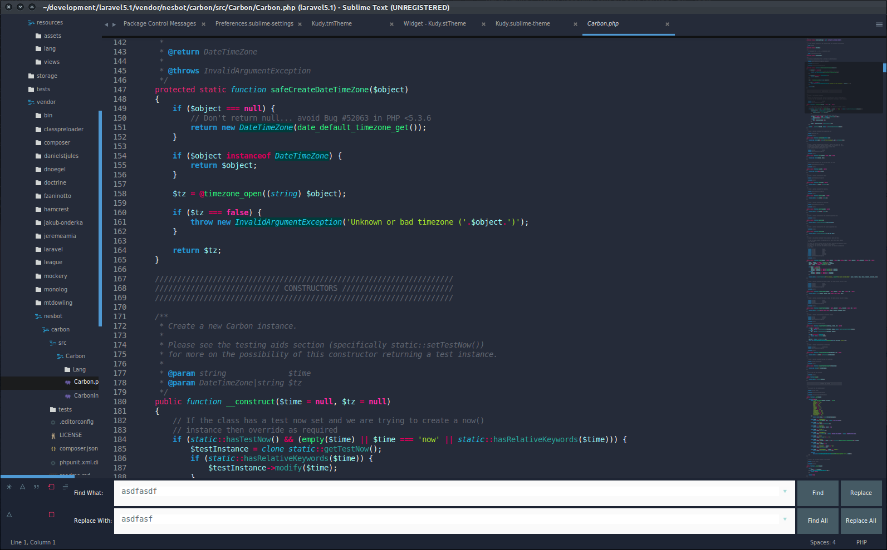

# Kudy

`SublimeText 3 Theme & ColorScheme` This is a modified version of the Seti_UI by [ctf0](https://github.com/ctf0/Seti_ST3) and with some inspiration from the [Soda Theme](https://github.com/buymeasoda/soda-theme) by [buysoda](https://github.com/buymeasoda) and with my own personal design preferences.

# Notes

- Any thing less than 'ST3 Build 3062' wont get the sidebar icons to work.

